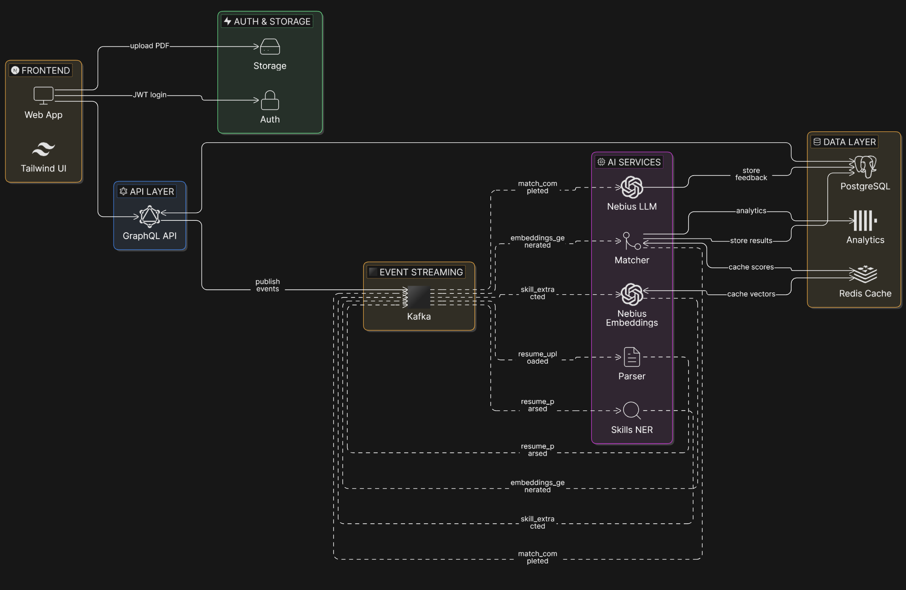
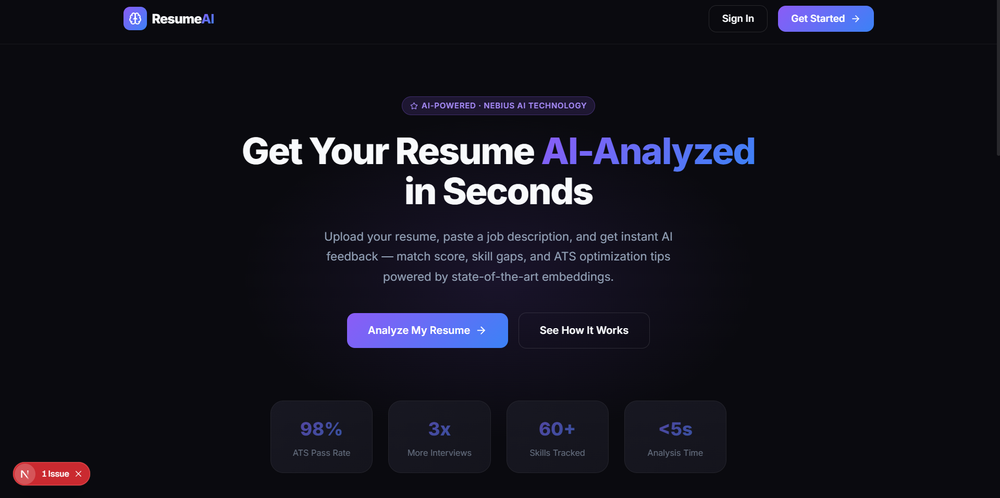
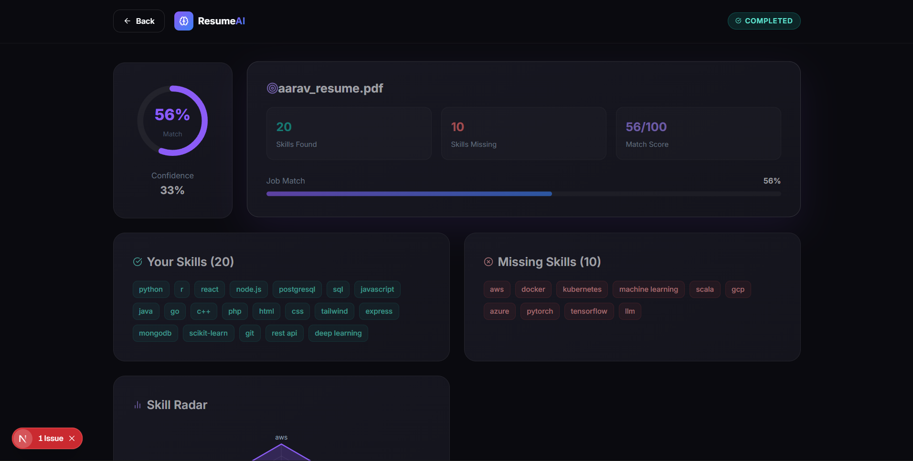
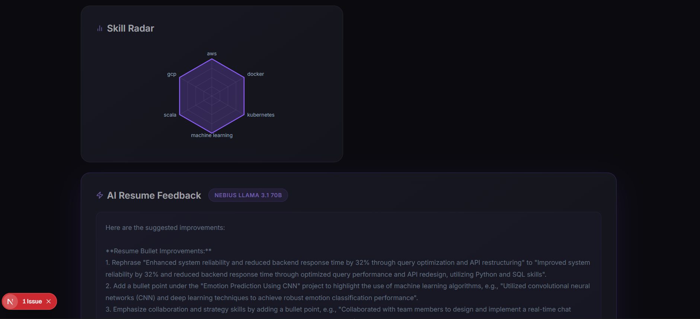

# Resume Analyser

AI-powered resume analysis platform built as a TypeScript monorepo.

System Design of project


This project lets a user:

- Upload a PDF resume
- Paste a job description
- Extract resume skills from PDF text
- Extract required skills from job description
- Compare JD required skills vs resume skills
- Generate match score, missing skills, and AI feedback
- Store analytics in ClickHouse

## UI Preview




## Working flow



## Stack

- Monorepo: Turborepo + npm workspaces
- Frontend: Next.js (apps/web)
- API: Express + Apollo GraphQL (apps/api)
- Workers: Kafka consumers (services/*)
- DB: PostgreSQL + Prisma
- Cache: Redis
- Event Bus: Kafka
- Analytics: ClickHouse

## Monorepo Layout

- apps/web: User-facing web app
- apps/api: GraphQL API gateway
- services/parser: PDF parsing worker
- services/embedder: Resume embedding worker
- services/skill-extractor: Resume skill extraction worker
- services/matcher: Resume-vs-job matching worker
- services/feedback: AI feedback worker
- packages/db: Prisma schema, migrations, ClickHouse schema
- packages/kafka: Shared Kafka helpers
- packages/types: Shared event/type contracts

## System Design Flow

The pipeline is event-driven. A selected job ID is carried through the flow so missing skills are computed against that exact pasted job description.

1. User uploads resume and creates a job from pasted JD (web -> API)
2. API stores resume + job and emits resume_uploaded event
3. Parser downloads PDF, extracts text, stores parsedText, emits resume_parsed
4. Embedder creates resume vector, stores resumeVector, emits embeddings_generated
5. Skill Extractor extracts resume skills from parsed text, stores ResumeSkill, emits skill_extracted
6. Matcher loads selected job, computes:
	- similarity score (vector-based)
	- missing skills (job required skills minus resume skills)
	- confidence
7. Matcher stores MatchResult and emits match_completed
8. Feedback worker generates AI feedback and stores it on Resume
9. Dashboard polls and renders final score, missing skills, and feedback

## Runtime Status Lifecycle

Resume status values in PostgreSQL:

- UPLOADED
- PARSING
- PARSED
- EMBEDDING
- EMBEDDED
- SKILL_EXTRACTED
- COMPLETED
- FAILED

## Prerequisites

- Node.js 18+
- npm 10+
- Docker + Docker Compose

## Clone And Run (Recommended)

1. Clone repo and open root directory
2. Start infrastructure:

```bash
docker compose up -d
```

3. Install dependencies:

```bash
npm install
```

4. Initialize Prisma client and migrations:

```bash
npm --workspace @resume-analyser/db run generate
npm --workspace @resume-analyser/db run migrate -- --name init_local
```

5. Initialize ClickHouse analytics schema:

```bash
cat packages/db/clickhouse/schema.sql | docker exec -i resume_clickhouse clickhouse-client --multiquery
```

6. Start all apps + services:

```bash
npm run dev
```

Or use helper scripts:

Windows PowerShell:

```powershell
.\run-all.ps1
.\run-all.ps1 -Migrate
```

Bash:

```bash
./run-all.sh
./run-all.sh --migrate
```

## Environment Files

You need these env files populated:

- apps/api/.env
- apps/web/.env
- packages/db/.env
- services/parser/.env
- services/embedder/.env
- services/skill-extractor/.env
- services/matcher/.env
- services/feedback/.env

Core keys by area:

- Database: DATABASE_URL
- API: API_PORT, REDIS_URL, NEXT_PUBLIC_SUPABASE_URL, SUPABASE_SERVICE_ROLE_KEY
- Web: NEXT_PUBLIC_API_URL, NEXT_PUBLIC_SUPABASE_URL, NEXT_PUBLIC_SUPABASE_ANON_KEY, NEXT_PUBLIC_SUPABASE_BUCKET_NAME
- Kafka: KAFKA_BROKERS, KAFKA_CLIENT_ID, KAFKA_GROUP_ID_PREFIX
- Kafka TLS (if needed): KAFKA_CA_PATH, KAFKA_CERT_PATH, KAFKA_KEY_PATH
- AI: NEBIUS_API_KEY, NEBIUS_BASE_URL, NEBIUS_EMBED_MODEL, NEBIUS_LLM_MODEL
- ClickHouse: CLICKHOUSE_HOST, CLICKHOUSE_ENABLED, optional CLICKHOUSE_USER/CLICKHOUSE_PASSWORD

Important:

- Do not commit real secrets.
- Use local values for local development whenever possible.

## Ports

- Web: 3000
- Docs app: 3001
- API GraphQL: 4000
- PostgreSQL: 5432
- Redis: 6379
- Kafka: 9092
- ClickHouse HTTP: 8123
- ClickHouse Native: 9000

## Verify The System

API health:

```bash
curl http://localhost:4000/health
```

ClickHouse health:

```bash
curl "http://localhost:8123/?query=SELECT%201"
```

Open web UI:

- http://localhost:3000

## Common Troubleshooting

1. 429 Too Many Requests on dashboard
- Increase API rate limit for local dev or reduce polling interval.

2. Resume stuck at SKILL_EXTRACTED
- Check matcher service logs.
- Check Kafka consumer group config and backlog.

3. ClickHouse timeout
- Verify CLICKHOUSE_HOST points to reachable host.
- For local dev, use http://localhost:8123 and apply schema.sql.

4. Feedback takes too long
- Check feedback service logs and AI API latency.
- Fallback feedback is enabled when LLM call fails.

5. Port already in use (3000/3001/4000)
- Stop old node processes, then restart npm run dev.

## Build And Quality Commands

```bash
npm run build
npm run lint
npm run check-types
```

## License

Add your project license here.
